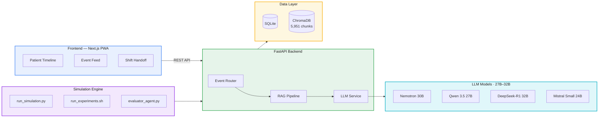

# 🏥 CareLoop AI

### Multi-Agent Simulation for Evidence-Based Nursing Home Care

[](https://memowell-next-production.up.railway.app)
[]()
[](LICENSE)

> **CareLoop** is a multi-agent AI system that parses clinical behavioral events, matches evidence-based protocols via RAG, and recommends interventions in real time — with zero hallucination by design.

---

## 🎬 Demo Video

[](https://github.com/GuilinDev/memowell-ai/raw/main/docs/assets/careloop-demo.mp4)

> 📺 *GIF preview auto-plays above — [click for full 50s video](https://github.com/GuilinDev/memowell-ai/raw/main/docs/assets/careloop-demo.mp4) with audio. Three acts: critical event → 25-patient parallel simulation → metrics dashboard.*

---

## 🔬 Multi-Model Ablation Study

We benchmark **4 open-source LLMs (27B–32B parameter range)** across **3 nursing shifts** on an NVIDIA DGX Spark (128GB unified memory):

| Model | Parameters | Architecture | Key Strength |
|-------|-----------|--------------|-------------|
| **Nemotron-3-Nano** | 30B | Dense (NVIDIA) | Fastest inference (~15s/event) |
| **Qwen 3.5** | 27B | Dense (Alibaba) | Balanced speed/quality |
| **DeepSeek-R1** | 32B | MoE + RL reasoning | Deepest clinical reasoning |
| **Mistral Small 3.2** | 24B | Dense (Mistral) | Best instruction following |

### Research Questions

| RQ | Question | Models Compared |
|----|----------|----------------|
| **RQ1** | MoE vs Dense: speed-quality tradeoff? | DeepSeek-R1 vs Nemotron |
| **RQ2** | Does RL reasoning improve safety event identification? | DeepSeek-R1 vs Qwen 3.5 |
| **RQ3** | Agentic vs general-purpose in caregiving? | Nemotron (agent-tuned) vs Mistral |
| **RQ4** | Which architecture yields highest protocol compliance? | All 4 models |

### Current Results (Experiment In Progress)

```
📊 204+ simulated events  |  25 patients  |  7 event types  |  3 shifts
📈 92% protocol coverage  |  68% intervention success rate
🔧 12 experiment rounds (4 models × 3 shifts)
```

---

## 🏗️ Architecture



### Multi-Provider LLM Service

```python
# Unified interface — switch between cloud and local with env vars
LLM_PROVIDER=groq    LLM_MODEL=llama-3.3-70b-versatile   # Cloud (Railway)
LLM_PROVIDER=ollama  LLM_MODEL=nemotron-3-nano:30b        # Local (DGX Spark)
```

---

## 📚 Knowledge Base (RAG)

| Source | Documents | Chunks |
|--------|-----------|--------|
| CMS (Centers for Medicare & Medicaid) | Appendix PP, GUIDE Model, F-Tags | ~3,500 |
| Alzheimer's Association | Care Practice, Assisted Living, Clinical 2024 | ~1,200 |
| APA | Dementia Evaluation Guidelines | ~200 |
| NICE (UK) | NG97 Dementia Management | ~100 |
| **Total** | **8 PDFs** | **5,951 chunks** |

Every protocol suggestion is retrieved from these sources — **never generated**. Zero tolerance for hallucination in clinical contexts.

---

## 🚀 Quick Start

### Cloud Deployment (Groq)
```bash
cd api
pip install -r requirements.txt
echo "GROQ_API_KEY=your_key" > ../.env
python -m uvicorn main:app --host 0.0.0.0 --port 8000
```

### Local Simulation (Ollama)
```bash
# Install Ollama + pull a model
ollama pull nemotron-3-nano:30b

# Run single simulation
cd simulation
LLM_PROVIDER=ollama LLM_MODEL=nemotron-3-nano:30b python run_simulation.py --shift day

# Run full ablation (4 models × 3 shifts)
bash run_experiments.sh
```

### Frontend
```bash
cd apps/next
npm install && npm run dev
# Open http://localhost:3000
```

---

## 🔗 Key Design Decisions

- **RAG, not generation** — Protocol suggestions come from retrieval only. Clinical compliance demands zero hallucination.
- **Simulation-first** — Validate AI behavior in simulation before deploying to real patients.
- **Parameter-aligned models** — All models in the 27B–32B range for fair comparison (avoids reviewer criticism of capacity mismatch).
- **C→I→O structured data** — Every event captures Context → Intervention → Outcome, building a structured dataset for analytics.
- **Multi-provider architecture** — Same codebase runs on Groq (cloud) or Ollama (local GPU) with an env var switch.

---

## 📄 Related Work

- **XAI Robustness Evaluation** — Under review at *Applied Intelligence* (Springer). Evaluates 6 XAI methods across 15 corruption types. The robustness framework bridges into CareLoop for explainable clinical decision support.

---

## 🗺️ Roadmap

| Phase | Status | Description |
|-------|--------|-------------|
| **Phase 1** | ✅ Live | Behavioral event copilot + auto-handoff (RAG + LLM) |
| **Phase 2** | 🔬 Now | Multi-model ablation study + NeurIPS paper |
| **Phase 3** | 📋 Planned | Clinical pilot with nursing home partner |
| **Phase 4** | 📋 Planned | Intervention ranking, risk prediction, digital twin |

---

<!--
## 👥 Team

- **Guilin Zhang** — AI/ML Architecture, XAI Research ([Google Scholar](https://scholar.google.com/citations?user=dx-9AfQAAAAJ))
- **Kai Zhao** — Product Strategy, Industry Partnerships
- **Dr. Dezhi Wu** — Domain Expertise, HCI × AI in Healthcare (USC)
-->

---

## 📊 Market Context

The U.S. skilled nursing facility market is **$200B** (Grand View Research, 2024), yet AI agent adoption in healthcare remains **<2%** of all deployments ([Anthropic Agent Autonomy Report, 2026](https://www.anthropic.com/research/measuring-agent-autonomy)). CareLoop targets this gap.

---

## License

MIT
